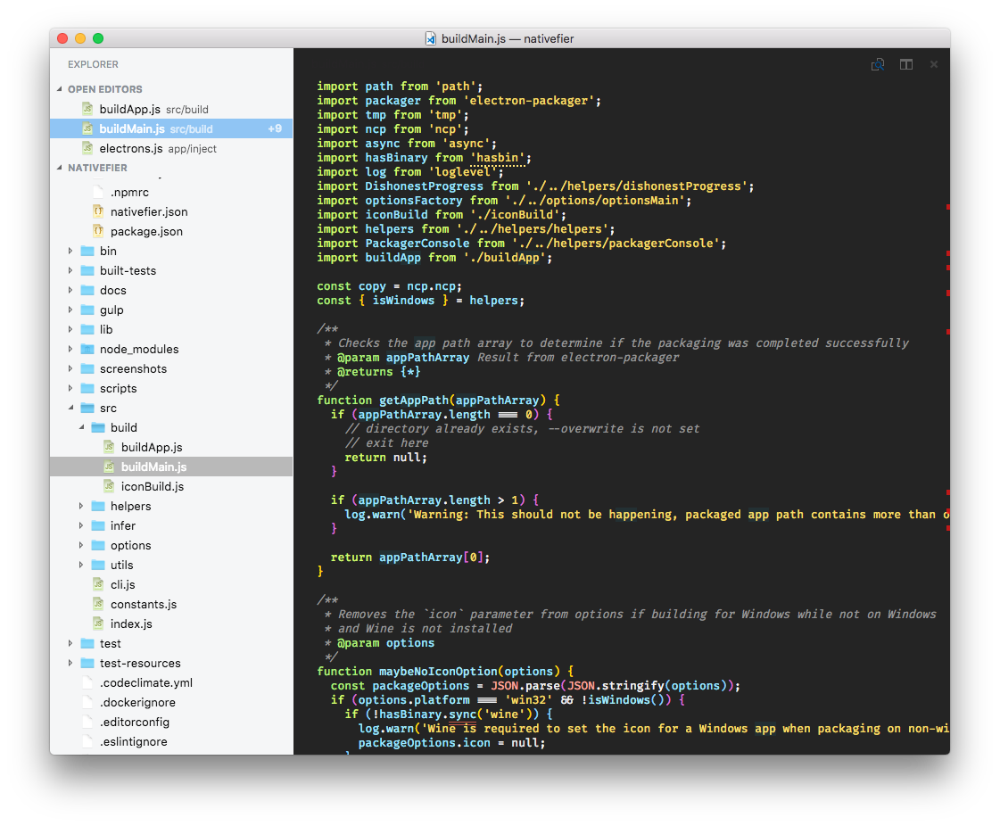

# Sickly Sweet

Visual elements of my Visual Studio Code setup for replacing / supplementing the [Chocolat](https://chocolatapp.com) editor. This is more of those "for me so that I can set it up next time" repos.

## Color Theme

The Theme is named macOS Smyck. The Syntax theme is [Smyck](http://color.smyck.org), combined with workspace colors based on [the macOS Classic theme](https://marketplace.visualstudio.com/items?itemName=nkjoep.mac-classic-theme).
 
## Icon Theme

An icon theme based on icons ripped from the Chocolat.app and macOS. Because the icons are likely copypright protected, they are not included in this repo. The script `grab_icons.sh` copies the items from macOS and from the Chocolat.app (if its in /Applications) and converts them to png.

## User Settings

Display related User Settings found in the workspace settings of this project at .vscode/settings.json. Mostly what I'm doing here is hiding bunch of stuff.

## Wishlist / Issues / TODO / Rants

If anyone knows how to do these things (without messing with the vscode binary) I would love to know.

- Hide tab bar: Come on, theres an option to disable tabs but it just puts a useless bar with the title of the file right under the titlebar?
- Hide explorer action icons and Heading (EXPLORER)
- Hide overview ruler: I think I'm just missing how to do this
- Right click "New File/Folder" on root folder
- Explorer on the left, debugger on the right
- Color Contrast of extension html pages: somehow I can not get this to work with a dark syntax/light workspace theme, but I'm pretty sure I'm missing something
- Icon colors (Panel / Terminal). Can you set these somehow?
- Full bleed highlight lines: Line highlights should extend into the left gutter, explorer selections should not have a 1px border on the right to the text area (is this a bug or am I missing a border color setting?)
- Error higlights in the line numbers gutter instead of the overview ruler
- Line numbers only on hover: I find them distracting but I do need to reference them sometimes.
- No squiggly lines: I would like either a straight line like the macOS spell checker or background highlight like matching symbols
- Different look for the lightbulb: This just looks out of place? Like its taken from eclipse in 2008 or something.